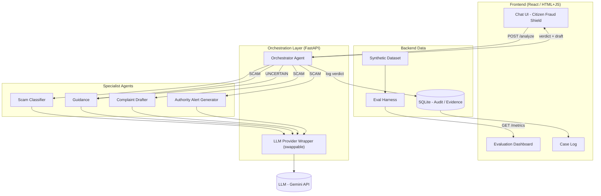
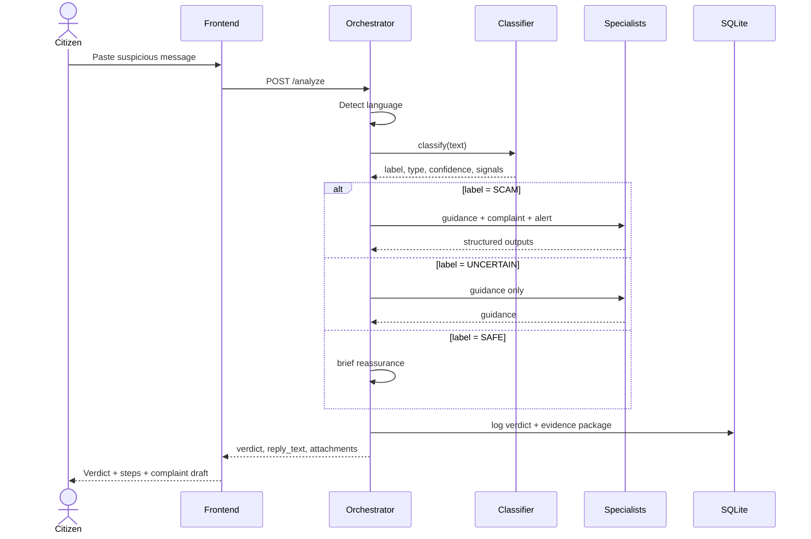
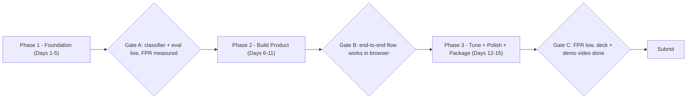

# Raksha — Master Build Plan
### ET AI Hackathon 2.0 · Problem Statement 6 (Digital Public Safety)
**Scoped build:** Digital Arrest Scam Detector + Citizen Fraud Shield
**Window:** 15 days · **Team:** 2 AI/agent engineers + 2 M.Tech (AI & DS)

> This is the single source of truth. If a decision isn't here, decide it as a team and
> add it here — do not let two people solve the same thing two different ways.
> Companion files: `requirements.txt` (backend deps), `agent_prompts.md` (agent system
> prompts), `.gemini/antigravity/brain/guardrails.md` (Antigravity scope rules).

---

## 1. TL;DR
A multilingual web assistant where a citizen pastes a suspicious message or call transcript
and instantly gets: a verdict (**SCAM / SAFE / UNCERTAIN**), plain-language guidance, an
auto-drafted cyber-crime complaint (1930 / cybercrime.gov.in), and a logged, exportable
evidence package. Built as an orchestrated multi-agent system. The metric we live or die by
is a **very low false-positive rate** on the citizen tool — that is what PS6's Evaluation
Focus grades, and it is our headline.

---

## 2. Scope — build this, not that

**BUILD (and nothing beyond it):**
- Scam Classifier (digital arrest + 6 other Indian scam types), three-way output.
- Citizen Fraud Shield: chat UI, multilingual (EN + HI + one of TE/KN), instant verdict,
  guidance, complaint draft.
- Authority Alert artifact (generated only — maps to "MHA alert generation").
- Audit trail + downloadable evidence package (maps to "legal admissibility").
- Evaluation dashboard: precision / recall / F1 / **false-positive rate** + confusion matrix.

**DO NOT BUILD (out of scope — PS says examples are illustrative):**
- ❌ Counterfeit-currency computer vision  ❌ Fraud-network graph  ❌ Geospatial crime map
- ❌ Live telecom/call interception  ❌ Real IVR telephony  ❌ 12 languages (do 3 well)
- WhatsApp channel = **stretch only**, never before the core works end-to-end.

If anyone is "just adding" one of the ❌ items, stop them. Scope creep is the #1 way this build fails.

---

## 3. Why this wins (rubric mapping)
| Rubric (weight) | How we win it |
|:--|:--|
| Innovation (25%) | Digital-arrest detection is fresh; few teams attempt it well. Audit/evidence package is rare. |
| Business Impact (25%) | ₹1,776 cr lost in 9 months; concrete, emotional, every judge relates. |
| Technical Excellence (20%) | Clean multi-agent design + a real measured **low FPR** with a confusion matrix on screen. |
| Scalability (15%) | Provider-agnostic LLM, stateless API, channel-extensible (web → WhatsApp → telecom). |
| User Experience (15%) | Calm, multilingual, visceral live demo: scam caught → guided → complaint drafted. |

**The trust moment that wins the room:** show it returning **SAFE** on a real bank OTP
message (no false alarm), then **SCAM** on a digital-arrest script. That contrast is the demo.

---

## 4. System architecture



**Three layers:**
- **Frontend** — what the citizen and judges see: chat shield, eval dashboard, case log.
- **Orchestration (the "middleware")** — FastAPI app + Orchestrator agent (language detect,
  route, fuse) + provider-agnostic LLM wrapper.
- **Backend** — specialist agents, SQLite audit store, synthetic dataset, eval harness.

Keep the orchestrator and the API in **one FastAPI service** for the prototype. Do not split
into microservices.

---

## 5. Request flow



---

## 6. Repository structure (freeze this Day 1)

```
raksha/
├─ backend/
│  ├─ app/
│  │  ├─ main.py            # FastAPI entry, routes, CORS
│  │  ├─ orchestrator.py    # language detect, routing, fusion
│  │  ├─ schemas.py         # Pydantic models = THE CONTRACTS (frozen)
│  │  ├─ store.py           # SQLite audit / evidence package
│  │  ├─ agents/
│  │  │  ├─ classifier.py
│  │  │  ├─ guidance.py
│  │  │  ├─ complaint.py
│  │  │  └─ alert.py
│  │  ├─ llm/
│  │  │  └─ wrapper.py      # provider-agnostic (Gemini default)
│  │  ├─ prompts/           # one file per agent (from agent_prompts.md)
│  │  └─ eval/
│  │     ├─ generate_data.py
│  │     ├─ run_eval.py
│  │     └─ metrics.py
│  ├─ data/
│  │  ├─ synthetic_dataset.json
│  │  └─ test_set.json
│  ├─ tests/
│  ├─ requirements.txt
│  └─ .env.example          # GEMINI_API_KEY=...  (never commit real .env)
├─ frontend/
│  └─ src/
│     ├─ ChatShield.{jsx|html}
│     ├─ EvalDashboard.{jsx|html}
│     └─ CaseLog.{jsx|html}
├─ .gemini/antigravity/brain/
│  └─ guardrails.md         # scope rules every agent inherits
├─ docs/
│  ├─ BUILD_PLAN.md         # this file
│  └─ agent_prompts.md
└─ README.md
```

---

## 7. Interface contracts — THE conflict-prevention layer

**Freeze these on Day 1.** Frontend builds against them with mock data; backend builds to
fill them. Neither team blocks the other. No schema changes without team sign-off.

**`POST /analyze`**
```json
// request
{ "text": "string", "user_details": { "amount_lost": null, "datetime": null,
  "suspect_phone": null, "suspect_upi": null, "platform": null } }
// response
{ "case_id": "uuid",
  "language": "en|hi|te|kn",
  "verdict": "SCAM|SAFE|UNCERTAIN",
  "reply_text": "string (in detected language)",
  "classification": { "label": "...", "scam_type": "...", "confidence": 0.0, "signals": [], "reasons": "..." },
  "guidance": { "headline": "...", "immediate_action": "...", "steps": [], "key_facts": [], "report_to": {} } ,
  "complaint_draft": { /* or null */ },
  "authority_alert": { /* or null */ } }
```

**`GET /metrics`** (eval dashboard)
```json
{ "n_test": 0, "precision": 0.0, "recall": 0.0, "f1": 0.0,
  "false_positive_rate": 0.0,
  "confusion_matrix": { "labels": ["SCAM","SAFE","UNCERTAIN"], "matrix": [[0,0,0],[0,0,0],[0,0,0]] },
  "by_scam_type": { } }
```

**`GET /cases`** and **`GET /cases/{case_id}`** (case log + evidence package)
```json
{ "case_id": "uuid", "timestamp": "ISO-8601", "input": "string",
  "language": "en", "label": "SCAM", "scam_type": "digital_arrest",
  "confidence": 0.0, "reasons": "...", "model": "gemini-...", "evidence_package_url": "..." }
```

The **agent I/O schemas** are in `agent_prompts.md` — those JSON shapes are also contracts.

---

## 8. Agents
Roster and full system prompts live in **`agent_prompts.md`**. Use them **verbatim**.
Runtime agents: Orchestrator, Scam Classifier, Guidance, Complaint Drafter, Authority Alert
Generator. Build-time: Synthetic Data Generator.

**Non-negotiable agent rules:**
- Classifier biases to **UNCERTAIN over SCAM**; SCAM needs confidence ≥ 0.80 + 2+ signals.
- Every agent returns **strict JSON**; backend enforces with Pydantic + one retry on
  malformed output (LLMs sometimes wrap JSON in markdown).
- Guidance/Complaint facts (1930, cybercrime.gov.in, "digital arrest is not real") are
  accurate — keep them exact.

---

## 9. Data & evaluation plan (the FPR battleground)
1. Run the Synthetic Data Generator to produce a **balanced, varied** labeled set across all
   scam types **plus legitimate-but-risky** messages (real bank OTPs, courier updates, UPI
   alerts) labeled SAFE. The legit set is what makes FPR meaningful.
2. Split into few-shot/train and a **held-out test set** (hand-check the test labels).
3. `run_eval.py` computes precision, recall, F1, **false-positive rate**, confusion matrix →
   serves `GET /metrics` → renders on the dashboard.
4. Iterate the classifier prompt until FPR is low **without** the tool becoming uselessly
   cautious. Track the number across iterations.

> If the legit examples are weak, your FPR number isn't believable. Spend real effort here.

---

## 10. 15-day build plan



| Phase | Days | Parallel tracks (owner) | Exit gate |
|:--|:--|:--|:--|
| **1 Foundation** | 1–5 | **Eng-1:** synthetic dataset + Classifier + eval harness. **Eng-2:** repo, FastAPI skeleton, schemas, LLM wrapper, orchestrator stub. **M.Tech-FE:** chat UI + dashboard shells against mock contracts. **M.Tech-Int:** SQLite store + `.env`/secrets + brain seed. | Classifier runs; a real (even bad) FPR number shows on the dashboard. |
| **2 Build product** | 6–11 | **Eng-2:** Guidance + Complaint + Alert agents + wire routing. **Eng-1:** improve dataset, push FPR down. **M.Tech-FE:** real UI wired to live API, multilingual (EN+HI+1). **M.Tech-Int:** audit log + evidence package + integration tests. | Paste scam → verdict → guidance → complaint → evidence, end-to-end in browser. |
| **3 Tune + package** | 12–15 | All: drive FPR down, confusion-matrix view, demo polish. **M.Tech-Int + Deepu:** deck + demo video. **Eng:** Q&A prep, edge-case hardening. | FPR low and shown; deck + 2-min demo video done; README complete. |

**Reserve the last full 2 days for deck + demo video.** Teams always underestimate the video.

---

## 11. Working rules to build without conflicts
1. **Contract-first.** `schemas.py` + the API contracts in §7 are frozen Day 1. Build against
   them. Changing a contract requires a 2-minute team agreement and an edit to this doc.
2. **One owner per module/folder.** Touch only your folder. Cross-folder change = ask the owner.
3. **Antigravity = one workspace/folder per track.** Run parallel agents on separate folders so
   they don't collide. (Antigravity's git branching is weak — prefer folder isolation +
   frequent integration on `main` over heavy branching.)
4. **Integrate daily.** Small commits. One person (M.Tech-Int) owns merges and runs the
   end-to-end smoke test after each merge.
5. **Secrets in `.env` only.** Commit `.env.example`, never a real key. Use one shared dev key
   with rate-limit awareness, or one key per dev.
6. **Definition of done per task:** code + passing test + matches the contract + a screenshot
   of it working (Antigravity produces these automatically).

---

## 12. Antigravity operating guide
- Drop `guardrails.md` into `.gemini/antigravity/brain/` **before** the first task so every
  agent inherits scope.
- Use **Planning mode** for every non-trivial task; read the **Implementation Plan** artifact
  and comment to remove any out-of-scope work **before** approving.
- Tell it: *"use `requirements.txt` as-is, do not add packages without asking"* and *"use the
  system prompts in `agent_prompts.md` verbatim."*
- Enforce Pydantic parsing + JSON-retry guard on every agent call.
- Capture its **browser recordings** of the end-to-end flow and dashboard — they feed the demo video.

---

## 13. Deliverables checklist (PS6)
- [ ] Working prototype (backend + frontend, runs locally)
- [ ] Architecture diagram (the one in §4, exported)
- [ ] Evaluation report (metrics + confusion matrix + FPR)
- [ ] Synthetic dataset + held-out test set
- [ ] Audit trail + sample evidence package
- [ ] README (setup + run + architecture)
- [ ] Presentation deck (10–15 min)
- [ ] Demo video (~2 min, end-to-end)

---

## 14. Finale demo script (10–15 min)
1. **Problem (60s):** ₹1,776 cr lost to digital-arrest scams in 9 months; reactive system fails.
2. **Live demo (3–4 min):** paste a digital-arrest script → **SCAM** flagged in Hindi → guidance
   → complaint draft → evidence package logged.
3. **Trust moment (30s):** paste a real bank OTP → **SAFE** (no false alarm). "We don't cry wolf."
4. **Eval dashboard (1 min):** confusion matrix + the **low false-positive rate**.
5. **Architecture (1 min):** the multi-agent design + auditability for admissibility.
6. **Scale + impact + roadmap (1 min):** web → WhatsApp → telecom/bank integration.
7. **Q&A.** Have the FPR number, dataset size, and "how we avoid false alarms" answers ready.

---

## 15. Risk register
| Risk | Mitigation |
|:--|:--|
| Scope creep into ❌ items | This doc + brain guardrails + plan-review gate. |
| FPR not believable (weak legit data) | Invest in legitimate-but-risky examples; hand-check test set. |
| LLM returns non-JSON mid-demo | Pydantic + one reprompt retry; fallback to UNCERTAIN. |
| Merge conflicts | Contract-first + one folder per owner + daily integration + single merge owner. |
| Antigravity adds bloat/extra packages | Pin to requirements.txt; review Implementation Plan before coding. |
| Multilingual output quality | Limit to 3 languages; spot-check HI/regional outputs with a native speaker. |
| API rate limits / key exhaustion | Cache eval runs; throttle; one key per dev if needed. |
```
